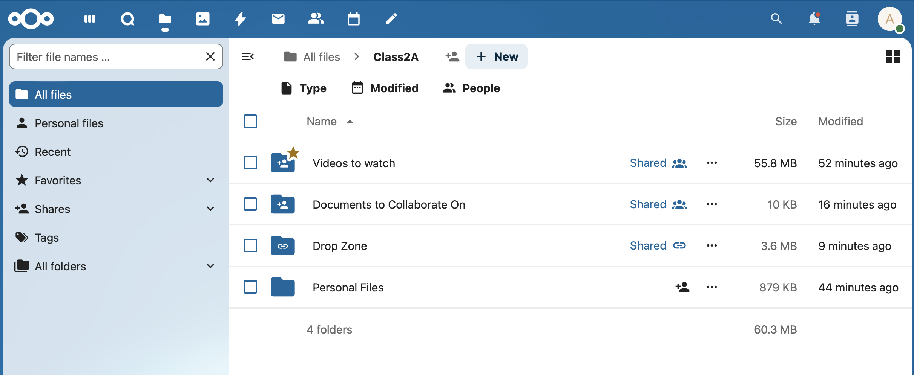
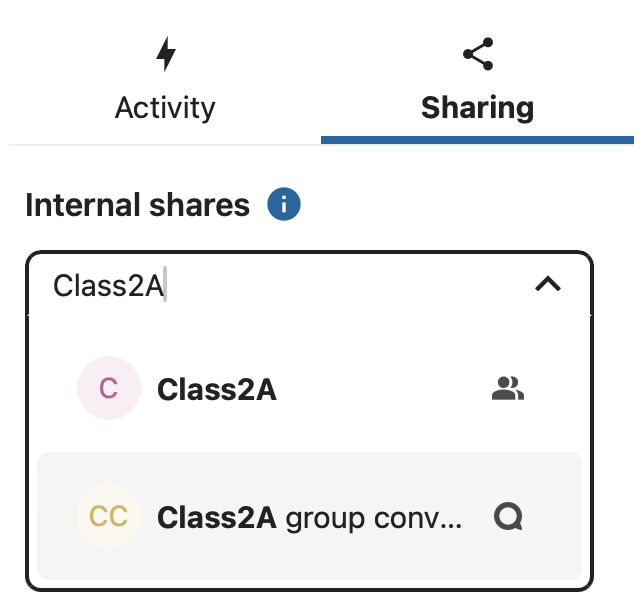
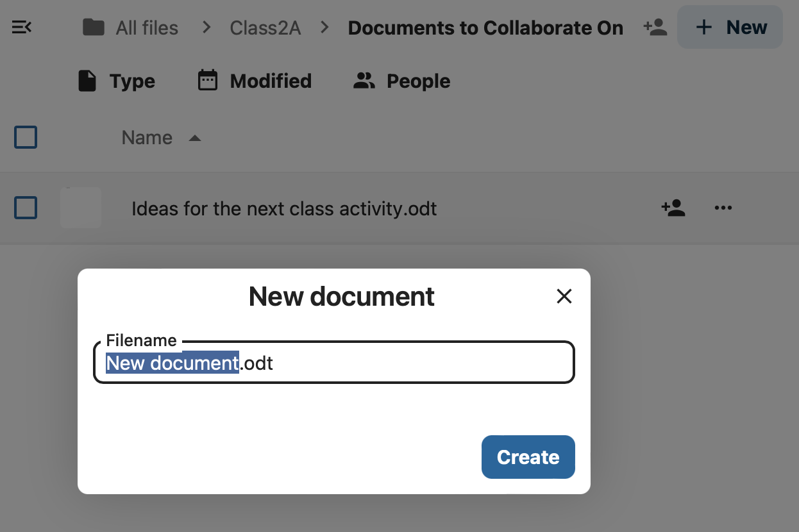
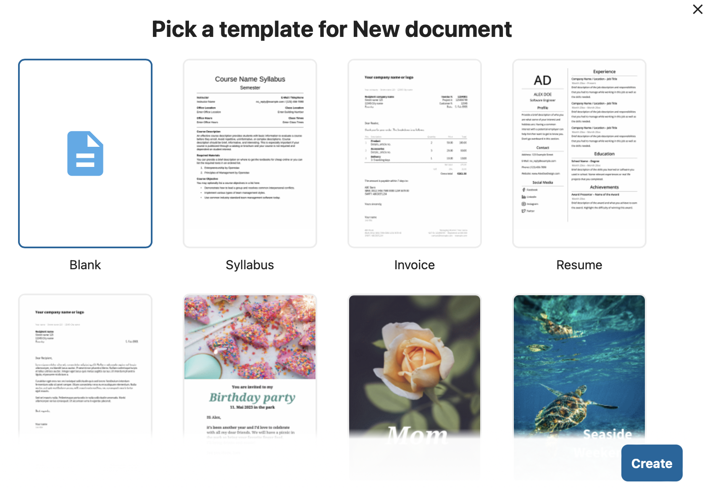
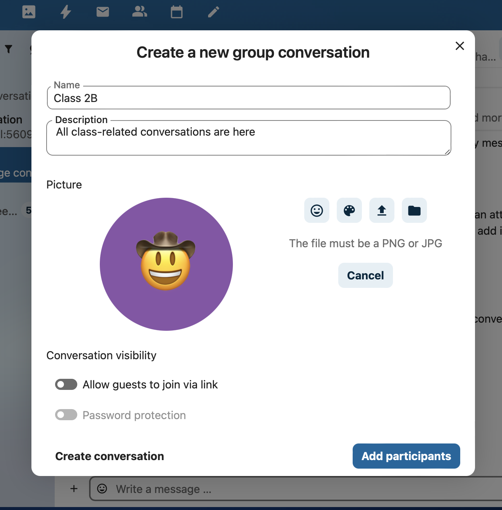
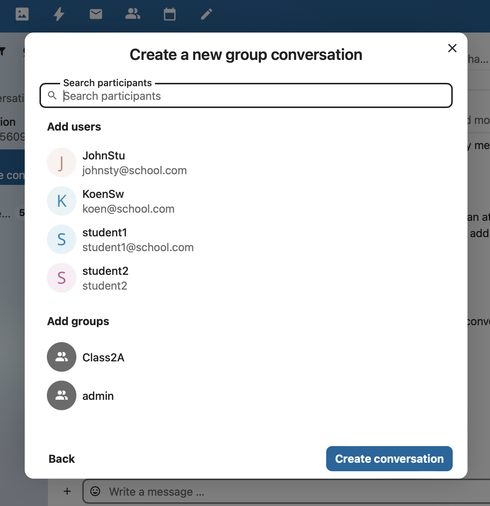

# Managing Your Digital Classroom with Nextcloud
## Sharing, Collecting, and Collaborating on the Appnet

*Reference: Manual Page 12. The Files app is your central hub for all classroom materials.*

---

# Distributing Read-Only Materials
**Goal:** Share a folder of videos or PDFs that students cannot delete or change.

*Reference: Manual Page 33.*

**Step 1: Open the Sharing Sidebar**
* Hover over your folder (e.g., "Videos to watch").
* Click the **Share icon** (the icon with a person and a +)

**Step 2: Select the Class and Set Permissions**
1. In the "Internal shares" box, type your class name (e.g., "Class2A") and select the Class.
2. Select **View Only**.

---

# Collecting Homework (The "File Drop")
**Goal:** Create a folder where students can upload their work, but cannot see what other students have submitted.

**Step 1: Create a Public Link**
1. Click the **Share icon** on your the folder in which you want to collect the work (e.g., "Drop Zone").
2. Click the **plus (+) button** next to "Create public link". 
3. Select **File request**  to enable File Drop Mode for this folder

**Step 2: Share the link with the students**
1. Click on the **Clipboard icon** to copy the link to the clipboard.  
2. Distribute this link to the students using Talk (see the Section on Talk)
3. *Result:* When students open this link, they see a "Click or drop to upload" area, but the folder appears empty to them.

---

# Collaborative Live Assignments
**Goal:** Students edit a single document simultaneously for group projects.

**Step 1: Creating the Document**
1. Click the **+ New** button in the top navigation bar.
2. Select **New Document**.
3. Give the document a name.

**Step 2: Pick a Template**
1. Select a template for the document

**Step 2: Managing the Live Session**
1. Share the resultng file with the Group and select **"Allow editing"**.
2. When students open the file, you will see their **avatars** in the top right corner.
3. **Action:** You can see student cursors moving in real-time as they type.

---

# Talk for Classroom Support
**Goal:** Use the Talk app to provide technical support and quick feedback to students.

**Action 1: Start a Support Chat**
* Open the **Talk app** from the top menu.
* Click the **+ Create a new conversation** button in the top navigation bar.

**Action 2: Add participants to the conversation**
* Click the **+ Add participants ** button.
* Search for a class name or a student's name and click to open a private conversation.

**Action 3: In the conversation, use the "Smart Picker" to share files**
1. In the chat bar, type **/** or click the **plus (+)** icon.
2. Select **Files** to instantly link a document you are discussing.
