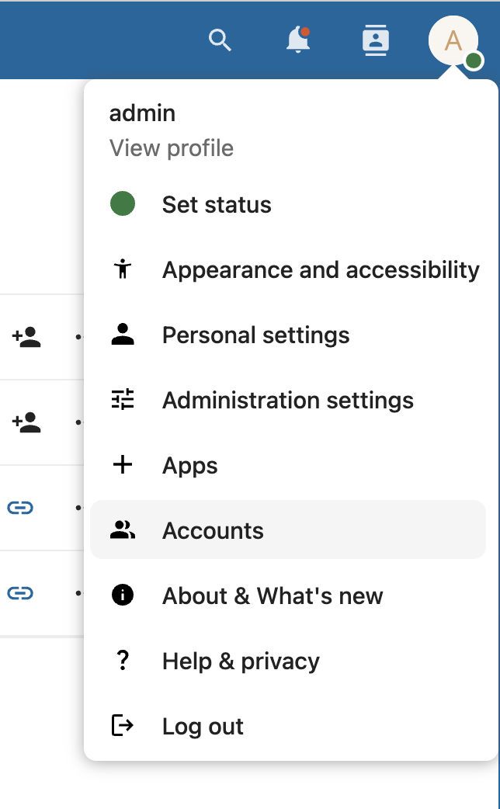
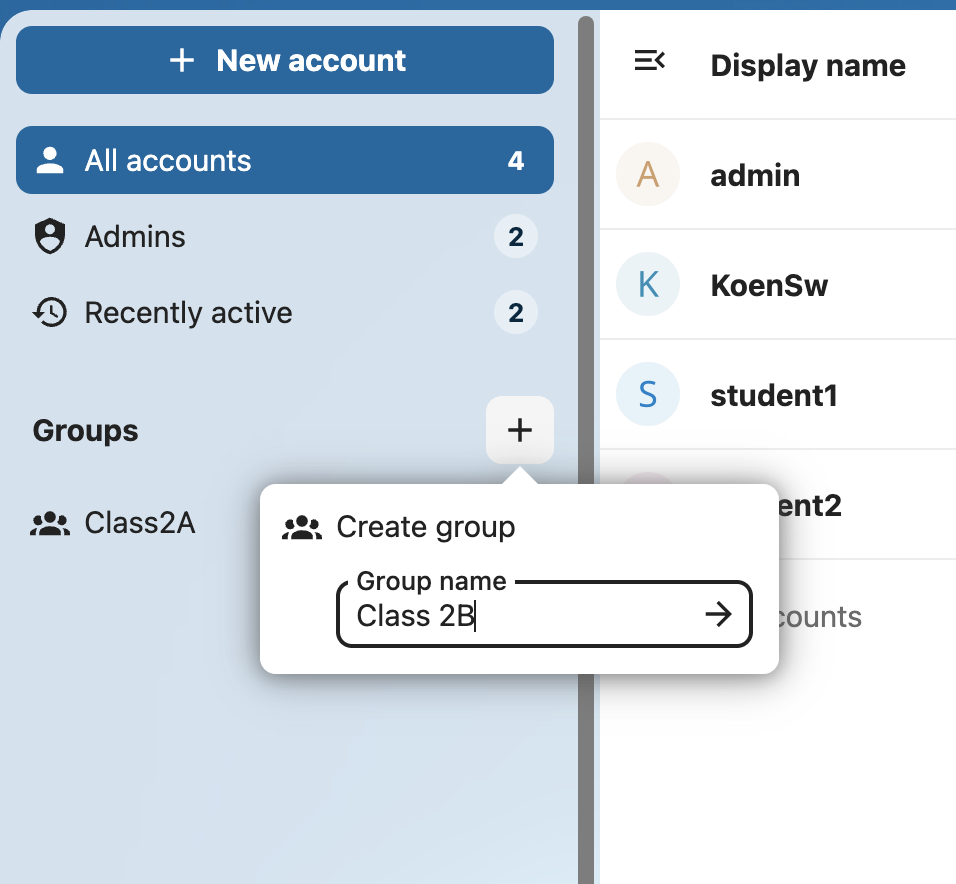
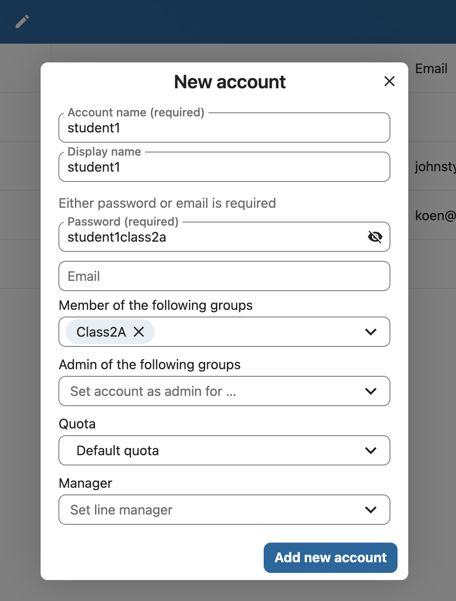
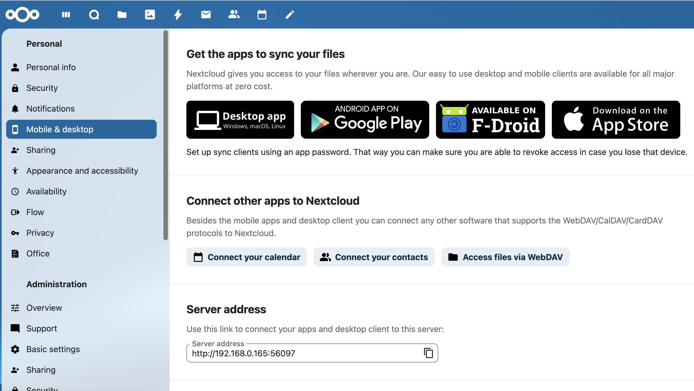

# Registering Users and Organizing Classes
## Creating digital identities on the Appnet

*To begin, you must access the Accounts dashboard.*

---

# Accessing the Accounts Dashboard
1. Look at the top-right corner of your screen.
2. Click your **Profile Picture/Icon**.
3. **Action:** Select **Accounts** from the dropdown menu.

---

# Creating a "Class" (Group)
**Goal:** Organizing students into a single class for easy sharing.

1. On the Users page, look at the **Left Sidebar**.
2. Click the **+** button at the right of **Groups**.
3. **Action:** Type the group name (e.g., "Class 2B") and press Enter.

---

# Registering a New Student
**Goal:** Create the digital account for a student.

1. Click the **+ New account** button (Top Left).
2. Fill in the **Account name** (e.g., `s.smith`).
3. Fill in the **Display name** (e.g., `Sarah Smith`).
4. Fill in a temporary **Password** (the student can still change this)
5. Add the Classes (groups) that this student will participate in
6. Click the Add new account button.

---

# Summary: The Power of Groups
*   **Without Groups:** You must share a file 30 times (once for each student).
*   **With Groups:** You share a folder **once** with "Class 2A".
*   **Result:** Nextcloud automatically grants access to every student inside that group instantly.

---

# Student Mobile Access
**Action:** Connecting a tablet or phone.

1. Look at the top-right corner of your screen.
2. Click your **Profile Picture/Icon**.
3. **Action:** Select **Personal settings** from the dropdown menu.
4. Click on the **Mobile & desktop** button.
5. Follow te instructions on the screen to install and configure the mobile app.

